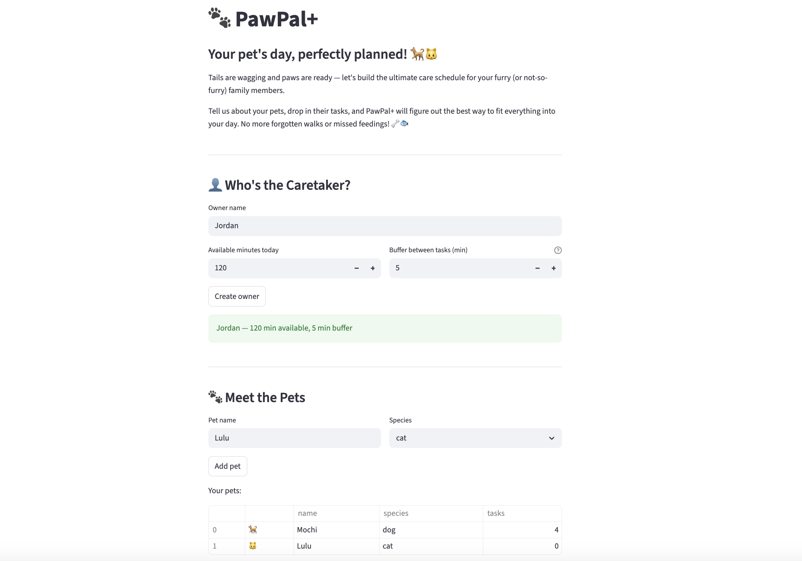
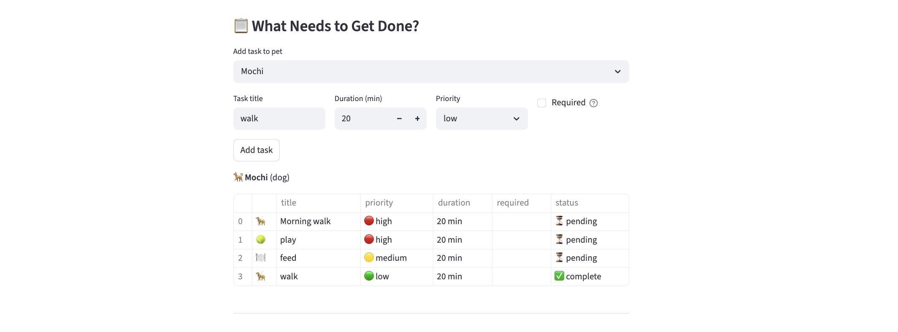
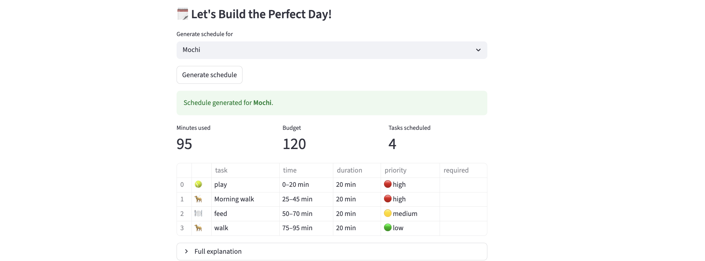

# PawPal+ 🐾

**PawPal+** is a Streamlit app that helps pet owners plan daily care tasks for their pets — built around smart scheduling, a friendly UI, and support for multiple pets.

## How It Works

PawPal+ walks you through five steps:

1. **Set up the owner** — enter your name, how many minutes you have today, and a buffer gap between tasks.
2. **Add your pets** — dog, cat, or other. Each pet gets their own task list.
3. **Add tasks** — set the title, duration, priority, and whether a task is required. Duplicate pending tasks are blocked automatically.
4. **Generate a schedule** — the scheduler picks the best combination of tasks that fits your time budget. Required tasks are always included. Multi-pet schedules are staggered so they never overlap.
5. **Mark tasks complete** — after running your schedule, check off tasks as you finish them. The section resets each time you generate a new schedule.

## Smarter Scheduling

Rather than picking tasks by priority until time runs out, PawPal+ uses a **0/1 knapsack algorithm** to find the highest-value combination of tasks that fits the available time. Required tasks are guaranteed a spot first, and optional tasks fill whatever capacity remains. When an owner has multiple pets, time is divided proportionally so no pet is shortchanged, and each pet's schedule is staggered on a shared timeline to prevent false conflicts.

## Features

- **0/1 Knapsack optimization** — finds the best combination of optional tasks by priority value, not just the first ones that fit.
- **Required task guarantee** — tasks marked required are always scheduled, even if they exceed the budget.
- **Duplicate task prevention** — adding the same pending task twice shows a warning and blocks the duplicate.
- **Staggered multi-pet scheduling** — each pet's plan starts after the previous one ends, eliminating false time-slot conflicts.
- **Persistent schedule display** — the generated schedule stays visible as you interact with other sections of the app.
- **Mark tasks complete** — a dedicated end-of-day section lets you check off finished tasks; resets on every new schedule generation.
- **Species filtering** — tasks can be restricted to a specific species and are excluded automatically for other pets.
- **Buffer time between tasks** — configurable rest/travel time inserted between consecutive tasks.
- **Recurring tasks** — completing a daily or weekly task automatically creates the next occurrence.
- **Cross-plan conflict detection** — flags overlapping time slots across pet plans with human-readable warnings.
- **Visual indicators** — task-type emojis, species emojis, priority color badges (🔴🟡🟢), required lock icons 🔒, and status badges (⏳ / ✅).

## Demo

**Owner & Pets Setup**

<a href="screenshots/owner_pets.png" target="_blank"></a>

**Task List**

<a href="screenshots/tasks.png" target="_blank"></a>

**Generated Schedule**

<a href="screenshots/schedule.png" target="_blank"></a>

**Mark Tasks Complete**

<a href="screenshots/complete.png" target="_blank"></a>

## Getting Started

```bash
python -m venv .venv
source .venv/bin/activate  # Windows: .venv\Scripts\activate
pip install -r requirements.txt
streamlit run app.py
```

## Testing PawPal+

### Run the tests

```bash
python -m pytest tests/test_pawpal.py -v
```

### What the tests cover

The suite contains 21 tests organized into four areas:

| Area | What is tested |
|---|---|
| **Sorting** | Tasks added in any order are stored shortest-first; sort is maintained after every `add_task` call; an empty pet list is handled correctly. |
| **Recurrence** | Completing a `daily` task spawns a new task due the next day; `weekly` advances by 7 days; the spawned task inherits all fields and starts as `pending`; a missing `due_date` falls back to today. |
| **Conflict detection** | Non-overlapping plans produce no warnings; overlapping time slots are flagged; tasks that touch at a boundary (end == start) are correctly treated as non-conflicting; edge inputs (`None`, no plans) return warning strings instead of crashing. |
| **Scheduler** | A pet with no tasks yields an empty plan; required tasks are always included even when they exceed the time budget; species-mismatched tasks are excluded; generated time slots are strictly sequential. |

### Confidence Level

**5 stars**

